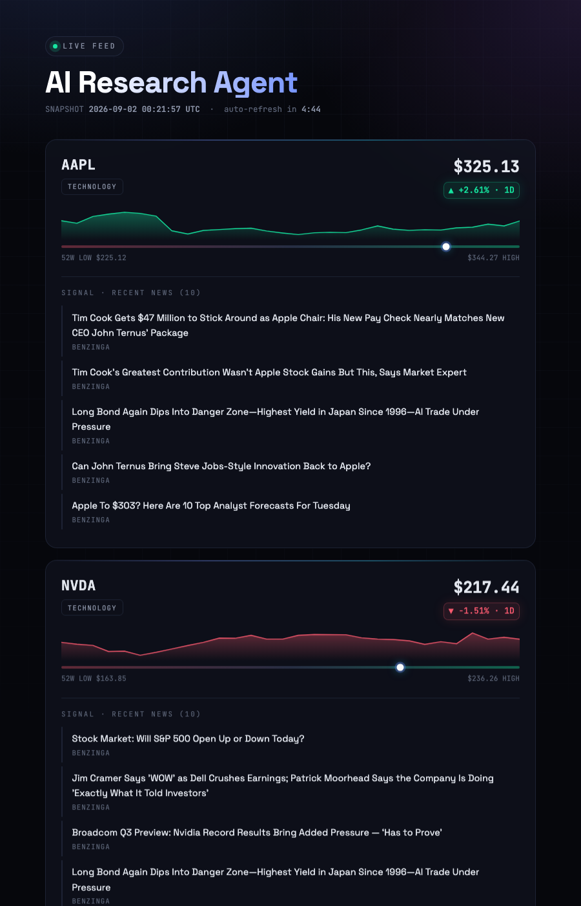
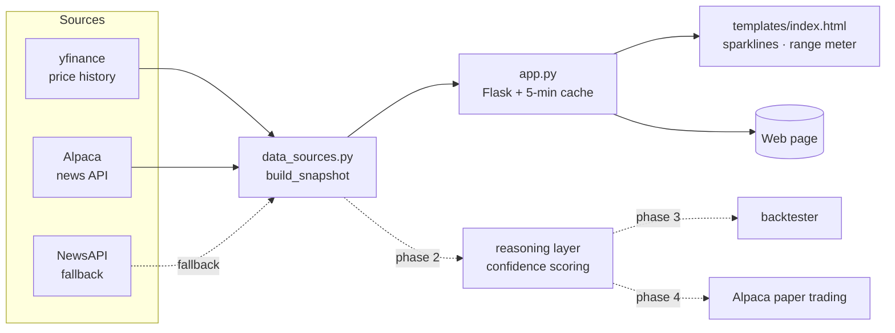

# AI Research Agent

An automated equity-research assistant. It pulls market data and news for a
watchlist, and is being built up — step by step — into a system that reasons
over that data with an LLM, backtests the resulting signals, and executes them
against a paper-trading account.

**Live demo:** https://ai-research-agent-hup1.onrender.com
*(free host — first request after idle takes ~30–50s to wake)*

> ⚠️ Educational project. Nothing here is investment advice, and no live money
> is ever traded.

---

## Status

| Phase | Scope | State |
|------:|-------|-------|
| **1** | Data layer — prices + news, deployed web snapshot | ✅ **Done** |
| **2** | LLM reasoning layer with confidence scoring | 🔜 Next |
| **3** | Backtesting harness | ⬜ Planned |
| **4** | Paper trading via Alpaca | ⬜ Planned |

Full detail and milestones in [ROADMAP.md](ROADMAP.md).
Change history in [CHANGELOG.md](CHANGELOG.md).

---

## What it does today

- Fetches 1 year of daily OHLCV per ticker (`yfinance`) and derives latest close,
  1-day change, and the true 52-week range.
- Fetches recent symbol-tagged news (`Alpaca` news API, with `NewsAPI` as an
  automatic fallback).
- Serves it all as a single cached web page — sparklines, a 52-week range meter,
  and a live countdown to the next refresh.



---

## Architecture



| File | Responsibility |
|------|----------------|
| [`data_sources.py`](data_sources.py) | All external data. `build_snapshot()` returns `{ticker: {price, news}}`. `get_news()` accepts `start`/`end` for point-in-time (backtest) queries. |
| [`app.py`](app.py) | Flask app. Caches the snapshot for 5 minutes, builds per-ticker view models (sparkline points, range position), serves `/` and `/healthz`. |
| [`templates/index.html`](templates/index.html) | Single self-contained page — no build step, no JS framework. |
| [`render.yaml`](render.yaml) | Infrastructure-as-code for the Render deployment. |

More design notes in [docs/ARCHITECTURE.md](docs/ARCHITECTURE.md).

---

## Quickstart

Requires **Python 3.12+**.

```bash
git clone https://github.com/prawbase7/AI_Agent.git
cd AI_Agent
python3 -m venv .venv && source .venv/bin/activate
pip install -r requirements.txt

cp .env.example .env      # then fill in your keys (see below)

python app.py             # http://localhost:8000
# or just the data layer:
python data_sources.py
```

### API keys

| Variable | Needed for | Where to get it |
|----------|-----------|-----------------|
| `ALPACA_API_KEY_ID` / `ALPACA_API_SECRET_KEY` | News (preferred), and phase 4 paper trading | [app.alpaca.markets](https://app.alpaca.markets) → enable MFA → **API** → Generate. Use **Paper Trading** keys. |
| `NEWSAPI_KEY` | News fallback only | [newsapi.org/register](https://newsapi.org/register) (free tier) |

The app runs without any keys — you just get prices and no news.
`.env` is gitignored; never commit real keys.

---

## Deployment

Hosted on [Render](https://render.com) as a free web service, defined by
[`render.yaml`](render.yaml) (blueprint). Pushes to `main` auto-deploy.

Environment variables (`ALPACA_*`, `NEWSAPI_KEY`) are set in the Render
dashboard, not in the repo. `PYTHON_VERSION` is pinned to 3.12.7 there.

To deploy your own copy: fork the repo → Render dashboard → **New → Blueprint** →
select the fork → add the env vars → Apply.

---

## Development

See [CONTRIBUTING.md](CONTRIBUTING.md) for branch/commit conventions and local
setup. Issues and planned work are tracked on the
[GitHub issue tracker](https://github.com/prawbase7/AI_Agent/issues); the
phase breakdown lives in [ROADMAP.md](ROADMAP.md).

## License

[MIT](LICENSE)
