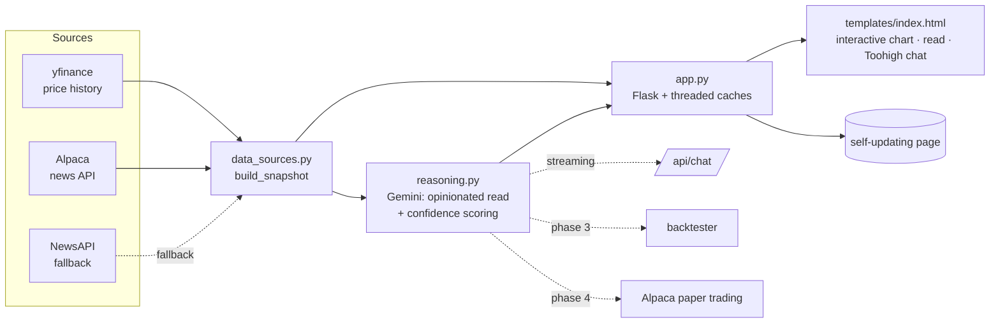

# AI Research Agent

An automated equity-research assistant. It pulls market data and news for a
watchlist, reasons over it with an LLM that takes a position, and is being built
up — step by step — toward backtesting those signals and running them against a
paper-trading account.

**Live demo:** https://ai-research-agent-hup1.onrender.com
*(free host — first request after idle takes ~30–50s to wake)*

> Personal project. The AI analysis is opinionated by design and can be wrong;
> it's a research aid, not advice, and no live money is traded.

---

## Status

| Phase | Scope | State |
|------:|-------|-------|
| **1** | Data layer — prices + news, deployed web snapshot | ✅ **Done** |
| **2** | LLM reasoning layer + chat, with confidence scoring | ✅ **Done** |
| **3** | Backtesting harness | 🔜 Next |
| **4** | Paper trading via Alpaca | ⬜ Planned |

Full detail and milestones in [ROADMAP.md](ROADMAP.md).
Change history in [CHANGELOG.md](CHANGELOG.md).

---

## What it does today

- Fetches 1 year of daily OHLCV per ticker plus today's **intraday** 5-minute
  bars (`yfinance`), and derives the latest close, 1-day change, and true
  52-week range.
- Fetches recent symbol-tagged news (`Alpaca` news API, `NewsAPI` fallback).
- Sends the whole snapshot to an LLM (`Gemini`) for one combined **market read**:
  what's happening, the top stories ranked by impact, cross-cutting themes, and
  for each name a plain-English walk-through — what happened → why → what it
  could change → what the stock did today → **the call on what happens next**,
  with a **stance + calibrated confidence score**. It commits to a view.
- **"Toohigh" chat** — ask it anything about the data or the read; it answers
  short and direct, reasoning from the signals, grounded in the same snapshot.
- One self-updating page: an interactive price chart (scrub 1D / 1M / 3M / 6M /
  1Y), the market read, and per-company analysis. It refreshes its own data
  in place every couple of minutes — no reload, so the chat is never disturbed.


---

## Architecture



| File | Responsibility |
|------|----------------|
| [`data_sources.py`](data_sources.py) | All external data. `build_snapshot()` returns `{ticker: {price, intraday, news}}`. `get_news()` accepts `start`/`end` for point-in-time (backtest) queries. |
| [`reasoning.py`](reasoning.py) | The LLM layer. `analyze_market(snapshot)` → combined briefing that takes a position, with per-ticker confidence scores. `chat_stream()` → grounded streaming chat. `news_fingerprint()` → skip the call when nothing changed. Best-effort: returns `None` if unconfigured. |
| [`app.py`](app.py) | Flask app. Independent caches for the price snapshot and the analysis (rebuilt on a background thread). Serves `/`, `/api/state`, `/api/analysis`, `/api/chat`, `/healthz`. |
| [`templates/index.html`](templates/index.html) | One self-contained page — no build step, no framework. Interactive chart, polls `/api/state` to update in place, streams chat, persists chat to `sessionStorage`. |
| [`render.yaml`](render.yaml) | Infrastructure-as-code for the Render deployment. |

More design notes in [docs/ARCHITECTURE.md](docs/ARCHITECTURE.md).

---

## Quickstart

Requires **Python 3.12+**.

```bash
git clone https://github.com/prawbase7/AI_Agent.git
cd AI_Agent
python3 -m venv .venv && source .venv/bin/activate
pip install -r requirements.txt

cp .env.example .env      # then fill in your keys (see below)

python app.py             # http://localhost:8000
# or just the data layer:
python data_sources.py
```

### API keys

| Variable | Needed for | Where to get it |
|----------|-----------|-----------------|
| `ALPACA_API_KEY_ID` / `ALPACA_API_SECRET_KEY` | News (preferred), and phase 4 paper trading | [app.alpaca.markets](https://app.alpaca.markets) → enable MFA → **API** → Generate. Use **Paper Trading** keys. |
| `NEWSAPI_KEY` | News fallback only | [newsapi.org/register](https://newsapi.org/register) (free tier) |
| `GEMINI_API_KEY` | Market read + chat | [aistudio.google.com/apikey](https://aistudio.google.com/apikey) — free tier, no card (default model is `flash-lite`; the full `flash` models allow only ~20 calls/day free) |

The app runs without any keys — prices always work; news needs Alpaca or NewsAPI;
the analysis and chat need Gemini. `.env` is gitignored; never commit real keys.

---

## Deployment

Hosted on [Render](https://render.com) as a free web service, defined by
[`render.yaml`](render.yaml) (blueprint). Pushes to `main` auto-deploy.

Environment variables (`ALPACA_*`, `NEWSAPI_KEY`) are set in the Render
dashboard, not in the repo. `PYTHON_VERSION` is pinned to 3.12.7 there.

To deploy your own copy: fork the repo → Render dashboard → **New → Blueprint** →
select the fork → add the env vars → Apply.

---

## Development

See [CONTRIBUTING.md](CONTRIBUTING.md) for branch/commit conventions and local
setup. Issues and planned work are tracked on the
[GitHub issue tracker](https://github.com/prawbase7/AI_Agent/issues); the
phase breakdown lives in [ROADMAP.md](ROADMAP.md).

## License

[MIT](LICENSE)
